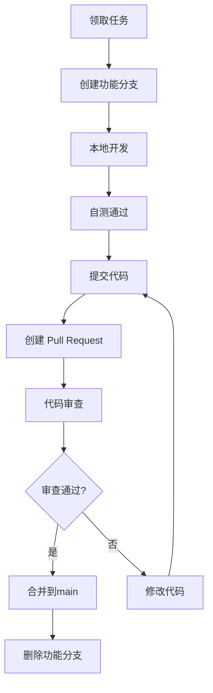

# 团队协作指南

**项目名称**: NowInOpenHarmony Backend
**协作场景**: 多人并行开发爬虫数据源
**更新日期**: 2025-11-16

---

## 📋 目录

1. [项目概述](#项目概述)
2. [团队分工](#团队分工)
3. [开发流程](#开发流程)
4. [代码规范](#代码规范)
5. [分支管理策略](#分支管理策略)
6. [文件命名规范](#文件命名规范)
7. [代码审查流程](#代码审查流程)
8. [冲突预防](#冲突预防)
9. [常见问题](#常见问题)

---

## 项目概述

### 当前架构

```
NowInOpenHarmony Backend
├── 数据采集层 (services/)
│   ├── ✅ OpenHarmony 官网新闻爬虫 (已完成)
│   ├── ✅ OpenHarmony 技术博客爬虫 (已完成)
│   ├── ✅ OpenHarmony Banner 爬虫 (已完成)
│   ├── 🆕 新数据源 A 爬虫 (待开发 - 成员1)
│   └── 🆕 新数据源 B 爬虫 (待开发 - 成员2)
├── API层 (api/)
├── 核心层 (core/)
└── 模型层 (models/)
```

### 技术栈
- **Web框架**: FastAPI 0.104.1
- **爬虫库**: Requests + BeautifulSoup4 + Selenium
- **数据库**: SQLite (开发) / PostgreSQL (生产)
- **版本控制**: Git + GitHub

---

## 团队分工

### 角色分配

| 角色 | 负责人 | 职责 | 工作内容 |
|------|--------|------|---------|
| **架构负责人** | 你 | 项目架构、代码审查、集成 | 维护核心模块、审查PR、解决冲突 |
| **爬虫开发者 A** | 成员1 | 开发数据源A爬虫 | 爬虫逻辑、API接口、数据模型 |
| **爬虫开发者 B** | 成员2 | 开发数据源B爬虫 | 爬虫逻辑、API接口、数据模型 |

### 工作边界

**✅ 各成员可以修改的文件**:
- `services/your_crawler_name.py` - 自己的爬虫文件(新建)
- `api/your_api_name.py` - 自己的API路由文件(新建)
- `models/your_model_name.py` - 自己的数据模型文件(新建)
- `requirements.txt` - 添加自己需要的依赖(谨慎)

**⚠️ 需要协调修改的文件**:
- `main.py` - 注册API路由(需要协调避免冲突)
- `core/database.py` - 添加数据库表(需要协调)
- `core/scheduler.py` - 添加定时任务(需要协调)
- `services/news_service.py` - 如果需要集成到统一服务

**❌ 不要修改的核心文件**:
- `core/cache.py` - 缓存管理(除非经过讨论)
- `core/config.py` - 配置管理(除非经过讨论)
- `core/logging_config.py` - 日志配置
- 其他成员的爬虫文件

---

## 开发流程

### 完整开发周期



### 详细步骤

#### 1️⃣ 领取任务并创建分支

```bash
# 1. 确保本地main分支是最新的
git checkout main
git pull origin main

# 2. 创建你的功能分支(命名规范见下文)
# 格式: feature/<数据源名称>-crawler
git checkout -b feature/datasource-a-crawler

# 例如:
# 成员1: git checkout -b feature/huawei-news-crawler
# 成员2: git checkout -b feature/harmonyos-forum-crawler
```

#### 2️⃣ 本地开发

```bash
# 1. 创建你的爬虫文件
# services/<数据源名称>_crawler.py

# 2. 创建你的API文件
# api/<数据源名称>.py

# 3. 创建你的模型文件(如果需要独立模型)
# models/<数据源名称>.py

# 4. 定期提交到本地
git add .
git commit -m "feat: 添加xxx功能"

# 5. 定期推送到远程(备份 + 让团队知道你的进度)
git push origin feature/datasource-a-crawler
```

#### 3️⃣ 开发完成后提交

```bash
# 1. 确保代码符合规范(运行测试)
python -m pytest tests/  # 如果有测试
python your_crawler.py   # 手动测试

# 2. 更新 main 分支(防止冲突)
git checkout main
git pull origin main

# 3. 回到你的分支并合并 main 的最新更改
git checkout feature/datasource-a-crawler
git merge main

# 4. 解决冲突(如果有)
# 编辑冲突文件 -> git add . -> git commit

# 5. 推送最终版本
git push origin feature/datasource-a-crawler
```

#### 4️⃣ 创建 Pull Request

在 GitHub 上:
1. 进入仓库页面
2. 点击 "Pull requests" -> "New pull request"
3. 选择: `base: main` <- `compare: feature/datasource-a-crawler`
4. 填写 PR 描述(使用下面的模板)

**PR 描述模板**:
```markdown
## 📝 变更说明
添加 [数据源名称] 爬虫

## ✨ 新增功能
- [ ] 爬虫逻辑实现 (`services/xxx_crawler.py`)
- [ ] API 接口实现 (`api/xxx.py`)
- [ ] 数据模型定义 (`models/xxx.py`)
- [ ] 数据库表创建
- [ ] 定时任务配置(可选)

## 🧪 测试情况
- [x] 本地测试通过
- [x] 爬虫能正常获取数据
- [x] API 接口正常响应
- [ ] 已添加单元测试(可选)

## 📸 测试截图
(可选) 贴上 API 测试截图或爬虫运行日志

## 🔗 相关 Issue
关闭 #issue编号 (如果有)

## ⚠️ 注意事项
- 修改了哪些共享文件: `main.py` 第XX行
- 添加了哪些依赖: `beautifulsoup4==4.12.2`
```

#### 5️⃣ 代码审查与合并

- **审查人**: 架构负责人
- **审查时间**: 24小时内
- **合并**: 审查通过后由架构负责人合并

---

## 代码规范

### Python 代码风格

遵循 **PEP 8** 规范:

```python
# ✅ 好的示例
class MyNewsCrawler:
    """新数据源爬虫类

    负责从 https://example.com 爬取新闻数据
    """

    def __init__(self, base_url: str):
        self.base_url = base_url
        self.session = requests.Session()

    def fetch_news(self, page: int = 1) -> List[Dict]:
        """获取新闻列表

        Args:
            page: 页码，从1开始

        Returns:
            新闻列表，每个元素包含标题、链接、日期等
        """
        pass

# ❌ 不好的示例
class mynewscrawler:  # 类名应该用大驼峰
    def FetchNews(self,page):  # 方法名应该用小写+下划线
        url=self.base_url+'/news?page='+str(page)  # 字符串拼接应该用f-string
        return requests.get(url).json()
```

### 爬虫开发规范

**1. 文件结构模板**

```python
# services/your_datasource_crawler.py
"""
[数据源名称] 爬虫
目标网站: https://example.com
数据类型: 新闻/论坛/文档等
"""

import logging
from typing import List, Dict, Optional
from datetime import datetime

import requests
from bs4 import BeautifulSoup

logger = logging.getLogger(__name__)


class YourDataSourceCrawler:
    """[数据源名称]爬虫类"""

    def __init__(self, base_url: str = "https://example.com"):
        """
        初始化爬虫

        Args:
            base_url: 目标网站根URL
        """
        self.base_url = base_url
        self.session = requests.Session()
        self.session.headers.update({
            'User-Agent': 'Mozilla/5.0 (Windows NT 10.0; Win64; x64) AppleWebKit/537.36'
        })

    def fetch_list(self, page: int = 1) -> List[Dict]:
        """
        获取列表页数据

        Args:
            page: 页码

        Returns:
            数据列表
        """
        try:
            url = f"{self.base_url}/list?page={page}"
            response = self.session.get(url, timeout=10)
            response.raise_for_status()

            soup = BeautifulSoup(response.text, 'html.parser')
            # 解析逻辑...

            return []

        except Exception as e:
            logger.error(f"获取列表页失败: {e}")
            return []

    def fetch_detail(self, detail_url: str) -> Optional[Dict]:
        """
        获取详情页数据

        Args:
            detail_url: 详情页URL

        Returns:
            详情数据字典，失败返回None
        """
        try:
            response = self.session.get(detail_url, timeout=10)
            response.raise_for_status()

            soup = BeautifulSoup(response.text, 'html.parser')
            # 解析逻辑...

            return {}

        except Exception as e:
            logger.error(f"获取详情页失败 {detail_url}: {e}")
            return None

    def save_to_database(self, data: List[Dict]) -> int:
        """
        保存数据到数据库

        Args:
            data: 要保存的数据列表

        Returns:
            成功保存的数据条数
        """
        from core.database import execute_update

        count = 0
        for item in data:
            try:
                # 检查是否已存在
                # 插入数据库
                count += 1
            except Exception as e:
                logger.error(f"保存数据失败: {e}")

        return count


# 模块级函数 - 供外部调用
def crawl_all() -> Dict[str, any]:
    """
    执行完整爬取流程

    Returns:
        包含爬取统计信息的字典
    """
    crawler = YourDataSourceCrawler()

    all_data = []
    for page in range(1, 6):  # 爬取前5页
        data = crawler.fetch_list(page)
        all_data.extend(data)

    saved_count = crawler.save_to_database(all_data)

    return {
        "total": len(all_data),
        "saved": saved_count,
        "status": "success"
    }


if __name__ == "__main__":
    # 本地测试代码
    result = crawl_all()
    print(f"爬取完成: {result}")
```

**2. API 开发模板**

```python
# api/your_datasource.py
"""
[数据源名称] API路由
"""

from typing import Optional
from fastapi import APIRouter, Query, HTTPException

from models.your_model import YourDataModel, YourDataResponse
from services.your_datasource_crawler import YourDataSourceCrawler

router = APIRouter(prefix="/api/your-datasource", tags=["您的数据源"])


@router.get("/", response_model=YourDataResponse)
async def get_data_list(
    page: int = Query(1, ge=1, description="页码"),
    page_size: int = Query(20, ge=1, le=100, description="每页数量"),
    keyword: Optional[str] = Query(None, description="搜索关键词")
):
    """
    获取数据列表
    """
    try:
        # 从数据库查询数据
        # ...

        return {
            "code": 200,
            "message": "success",
            "data": {
                "total": 100,
                "page": page,
                "page_size": page_size,
                "items": []
            }
        }
    except Exception as e:
        raise HTTPException(status_code=500, detail=str(e))


@router.post("/crawl")
async def trigger_crawl():
    """
    手动触发爬虫
    """
    from services.your_datasource_crawler import crawl_all

    try:
        result = crawl_all()
        return {
            "code": 200,
            "message": "爬取完成",
            "data": result
        }
    except Exception as e:
        raise HTTPException(status_code=500, detail=str(e))


@router.get("/status")
async def get_status():
    """
    获取服务状态
    """
    return {
        "code": 200,
        "message": "success",
        "data": {
            "status": "running",
            "last_update": "2025-11-16 10:00:00"
        }
    }
```

**3. 数据模型模板**

```python
# models/your_model.py
"""
[数据源名称] 数据模型
"""

from typing import Optional, List
from datetime import datetime
from pydantic import BaseModel, Field


class YourDataModel(BaseModel):
    """单条数据模型"""

    id: int = Field(..., description="数据ID")
    title: str = Field(..., description="标题")
    url: str = Field(..., description="链接")
    content: Optional[str] = Field(None, description="内容")
    author: Optional[str] = Field(None, description="作者")
    publish_time: Optional[datetime] = Field(None, description="发布时间")
    created_at: datetime = Field(default_factory=datetime.now, description="创建时间")

    class Config:
        json_schema_extra = {
            "example": {
                "id": 1,
                "title": "示例标题",
                "url": "https://example.com/article/1",
                "content": "文章内容...",
                "author": "张三",
                "publish_time": "2025-11-16T10:00:00",
                "created_at": "2025-11-16T10:05:00"
            }
        }


class YourDataResponse(BaseModel):
    """API响应模型"""

    code: int = Field(200, description="状态码")
    message: str = Field("success", description="响应消息")
    data: dict = Field(..., description="响应数据")
```

### 数据库规范

**表命名规范**:
```python
# 表名格式: <数据源名称>_<数据类型>
# 例如:
your_datasource_articles  # 你的数据源的文章表
your_datasource_comments  # 你的数据源的评论表
```

**建表语句示例**:
```python
# 在 services/your_datasource_crawler.py 的 __init__ 或专门的初始化函数中

from core.database import execute_update

def init_database():
    """初始化数据库表"""

    create_table_sql = """
    CREATE TABLE IF NOT EXISTS your_datasource_articles (
        id INTEGER PRIMARY KEY AUTOINCREMENT,
        title TEXT NOT NULL,
        url TEXT UNIQUE NOT NULL,
        content TEXT,
        author TEXT,
        publish_time DATETIME,
        created_at DATETIME DEFAULT CURRENT_TIMESTAMP,
        updated_at DATETIME DEFAULT CURRENT_TIMESTAMP
    )
    """

    execute_update(create_table_sql)

    # 创建索引
    execute_update("CREATE INDEX IF NOT EXISTS idx_url ON your_datasource_articles(url)")
    execute_update("CREATE INDEX IF NOT EXISTS idx_publish_time ON your_datasource_articles(publish_time)")
```

---

## 分支管理策略

### 分支类型

```
main (主分支)
  ├── feature/datasource-a-crawler (功能分支 - 成员1)
  ├── feature/datasource-b-crawler (功能分支 - 成员2)
  ├── hotfix/fix-cors-issue (热修复分支)
  └── release/v1.0.0 (发布分支 - 可选)
```

### 分支命名规范

| 分支类型 | 命名格式 | 示例 | 说明 |
|---------|---------|------|------|
| 功能分支 | `feature/<功能名称>` | `feature/huawei-news-crawler` | 开发新功能 |
| 修复分支 | `bugfix/<问题描述>` | `bugfix/fix-encoding-error` | 修复bug |
| 热修复 | `hotfix/<紧急问题>` | `hotfix/fix-cors-issue` | 紧急修复生产问题 |
| 发布分支 | `release/v<版本号>` | `release/v1.0.0` | 准备发布版本 |

### 分支生命周期

```bash
# 1. 创建功能分支
git checkout -b feature/your-crawler main

# 2. 开发过程中
# - 定期 commit
# - 定期 push 到远程
# - 定期从 main 合并最新代码

# 3. 完成开发
# - 创建 Pull Request
# - 代码审查
# - 合并到 main

# 4. 清理分支
git branch -d feature/your-crawler  # 删除本地分支
git push origin --delete feature/your-crawler  # 删除远程分支
```

---

## 文件命名规范

### 目录结构

```
services/
├── openharmony_news_crawler.py        ✅ 已存在
├── openharmony_blog_crawler.py        ✅ 已存在
├── mobile_banner_crawler.py           ✅ 已存在
├── your_datasource_a_crawler.py       🆕 成员1创建
└── your_datasource_b_crawler.py       🆕 成员2创建

api/
├── news.py                            ✅ 已存在
├── banner.py                          ✅ 已存在
├── your_datasource_a.py               🆕 成员1创建
└── your_datasource_b.py               🆕 成员2创建

models/
├── news.py                            ✅ 已存在
├── banner.py                          ✅ 已存在
├── your_datasource_a.py               🆕 成员1创建 (可选)
└── your_datasource_b.py               🆕 成员2创建 (可选)
```

### 命名规范

**Python 文件名**: 小写 + 下划线
```
✅ huawei_news_crawler.py
✅ harmonyos_forum_crawler.py
❌ HuaweiNewsCrawler.py
❌ huawei-news-crawler.py
```

**类名**: 大驼峰命名
```python
✅ class HuaweiNewsCrawler:
✅ class HarmonyOSForumCrawler:
❌ class huawei_news_crawler:
❌ class Huawei_News_Crawler:
```

**函数名/方法名**: 小写 + 下划线
```python
✅ def fetch_news_list():
✅ def parse_article_detail():
❌ def FetchNewsList():
❌ def parseArticleDetail():
```

**常量**: 全大写 + 下划线
```python
✅ BASE_URL = "https://example.com"
✅ MAX_RETRY_COUNT = 3
❌ baseUrl = "https://example.com"
```

---

## 冲突预防

### 可能产生冲突的场景

#### 场景1: 同时修改 `main.py`

**问题**: 两个人都要在 `main.py` 中注册自己的路由

**解决方案**:
```python
# main.py - 在文件末尾预留注册区域

from fastapi import FastAPI
from api import news, banner

app = FastAPI(title="NowInOpenHarmony API")

# ============= 核心路由 (不要修改) =============
app.include_router(news.router)
app.include_router(banner.router)

# ============= 新增路由区域 =============
# 成员1: 在这里注册你的路由
# from api import your_datasource_a
# app.include_router(your_datasource_a.router)

# 成员2: 在这里注册你的路由
# from api import your_datasource_b
# app.include_router(your_datasource_b.router)

# ============= 路由注册结束 =============
```

**协作流程**:
1. 成员1完成开发后,取消注释自己的路由,提交PR
2. PR合并到main后,成员2 pull 最新代码
3. 成员2在最新代码基础上取消注释自己的路由,提交PR

#### 场景2: 同时修改 `requirements.txt`

**问题**: 两个人都添加了依赖,导致冲突

**解决方案**:

1. **开发阶段**: 将依赖写在你的PR描述中
```markdown
## 新增依赖
- selenium==4.15.0
- pillow==10.0.0
```

2. **合并阶段**: 架构负责人统一添加依赖

3. **自动化方案** (推荐):
```bash
# 每个成员在自己的分支维护依赖
# 创建 requirements-<your-name>.txt
echo "selenium==4.15.0" > requirements-member1.txt
echo "pillow==10.0.0" > requirements-member2.txt

# 架构负责人合并时整合
cat requirements.txt requirements-member1.txt requirements-member2.txt | sort | uniq > requirements-new.txt
mv requirements-new.txt requirements.txt
```

#### 场景3: 同时修改 `core/database.py`

**问题**: 两个人都需要添加数据库初始化代码

**解决方案**: **不要修改核心数据库文件**

在自己的爬虫文件中管理自己的表:
```python
# services/your_crawler.py

from core.database import execute_update

def init_my_tables():
    """初始化我的数据表"""
    execute_update("""
        CREATE TABLE IF NOT EXISTS my_datasource_articles (
            id INTEGER PRIMARY KEY AUTOINCREMENT,
            title TEXT NOT NULL,
            ...
        )
    """)

# 在爬虫初始化时调用
class YourCrawler:
    def __init__(self):
        init_my_tables()  # 初始化表
        ...
```

#### 场景4: 同时修改 `core/scheduler.py`

**问题**: 两个人都要添加定时任务

**解决方案**:

**方案A**: 每个人在自己的爬虫文件中实现定时任务 (推荐)
```python
# services/your_crawler.py

from apscheduler.schedulers.background import BackgroundScheduler

class YourCrawler:
    def __init__(self):
        self.scheduler = BackgroundScheduler()
        self._setup_scheduler()

    def _setup_scheduler(self):
        """配置定时任务"""
        # 每小时执行一次
        self.scheduler.add_job(
            self.crawl_all,
            'interval',
            hours=1,
            id='your_crawler_job'
        )
        self.scheduler.start()
```

**方案B**: 在PR中说明需要添加的定时任务,由架构负责人统一添加到 `core/scheduler.py`

### 冲突解决流程

如果确实发生了冲突:

```bash
# 1. 拉取最新的 main 分支
git checkout main
git pull origin main

# 2. 回到你的功能分支
git checkout feature/your-crawler

# 3. 合并 main 到你的分支
git merge main

# 4. 查看冲突文件
git status

# 5. 手动解决冲突
# 编辑冲突文件,保留双方的修改
# 删除 <<<<<<<, =======, >>>>>>> 标记

# 6. 标记冲突已解决
git add <冲突文件>

# 7. 完成合并
git commit -m "merge: 解决与main分支的冲突"

# 8. 推送
git push origin feature/your-crawler
```

**冲突示例**:
```python
# main.py 冲突示例
<<<<<<< HEAD
# 成员1的代码
from api import datasource_a
app.include_router(datasource_a.router)
=======
# 成员2的代码
from api import datasource_b
app.include_router(datasource_b.router)
>>>>>>> main

# 解决后应该是:
from api import datasource_a, datasource_b
app.include_router(datasource_a.router)
app.include_router(datasource_b.router)
```

---

## 代码审查流程

### Pull Request 检查清单

**架构负责人审查时应检查**:

#### ✅ 代码质量
- [ ] 代码符合 PEP 8 规范
- [ ] 有适当的注释和文档字符串
- [ ] 没有硬编码的敏感信息(密码、API密钥等)
- [ ] 异常处理完善
- [ ] 日志记录合理

#### ✅ 功能完整性
- [ ] 爬虫能正常运行
- [ ] API 接口正常响应
- [ ] 数据能正确保存到数据库
- [ ] 错误情况能正确处理

#### ✅ 集成兼容性
- [ ] 不影响现有功能
- [ ] 依赖项没有冲突
- [ ] 数据库表名不冲突
- [ ] API路由不冲突

#### ✅ 文档完善
- [ ] PR描述清晰
- [ ] 代码有注释
- [ ] 如有新依赖,已说明用途

### 审查反馈

**使用 GitHub Review 功能**:
```
✅ Approve - 批准合并
💬 Comment - 提出建议但不阻止合并
❌ Request changes - 必须修改后才能合并
```

**常见审查意见**:
```markdown
📝 代码风格建议:
- 建议使用 f-string 代替字符串拼接
- 函数名应该用小写+下划线

🐛 潜在问题:
- 第45行可能会抛出 KeyError,建议使用 .get() 方法
- 缺少异常处理,建议添加 try-except

🔧 改进建议:
- 可以考虑添加重试机制
- 建议提取魔法数字为常量

✅ 优点:
- 代码结构清晰
- 错误处理完善
```

---

## 常见问题

### Q1: 如何避免两个人同时修改同一个文件?

**A**:
1. **沟通第一**: 在开发前在团队群里说明你要修改哪些文件
2. **最小化修改**: 尽量只修改自己的文件,不修改核心文件
3. **频繁同步**: 每天开始工作前 `git pull` 拉取最新代码

### Q2: 我的分支落后main很多版本,怎么办?

**A**:
```bash
# 定期合并main到你的分支
git checkout feature/your-crawler
git merge main

# 或者使用 rebase (让提交历史更清晰)
git checkout feature/your-crawler
git rebase main
```

### Q3: 我不小心在main分支上开发了,怎么办?

**A**:
```bash
# 1. 创建新分支(保留你的修改)
git checkout -b feature/your-crawler

# 2. 推送新分支
git push origin feature/your-crawler

# 3. 切回main并重置
git checkout main
git reset --hard origin/main
```

### Q4: 如何测试别人的代码?

**A**:
```bash
# 1. 拉取对方的分支
git fetch origin
git checkout feature/member-a-crawler

# 2. 安装依赖
pip install -r requirements.txt

# 3. 运行测试
python services/member_a_crawler.py

# 4. 测试API
uvicorn main:app --reload
# 访问 http://localhost:8001/docs
```

### Q5: 代码合并后发现问题,如何回滚?

**A**:
```bash
# 1. 查看提交历史
git log --oneline

# 2. 回滚到指定提交
git revert <commit-hash>

# 3. 推送回滚
git push origin main
```

### Q6: 如何查看项目当前的开发进度?

**A**:
- 查看 GitHub 的 "Branches" 页面,看有哪些活跃分支
- 查看 "Pull Requests" 页面,看有哪些待审查的PR
- 团队定期在群里同步进度

### Q7: 依赖项安装失败怎么办?

**A**:
```bash
# 1. 升级 pip
python -m pip install --upgrade pip

# 2. 使用国内镜像源
pip install -r requirements.txt -i https://pypi.tuna.tsinghua.edu.cn/simple

# 3. 如果某个包安装失败,先跳过
pip install -r requirements.txt --no-deps

# 4. 单独安装问题包
pip install <package-name>
```

---

## 开发检查清单

### 开始开发前

- [ ] 已阅读本协作指南
- [ ] 已克隆仓库到本地
- [ ] 已创建功能分支
- [ ] 已了解现有代码结构
- [ ] 已明确自己的数据源和任务

### 开发过程中

- [ ] 定期 commit (每完成一个小功能就提交)
- [ ] 定期 push (每天至少推送一次)
- [ ] 定期从 main 合并最新代码
- [ ] 遇到问题及时在群里沟通
- [ ] 保持代码风格一致

### 提交PR前

- [ ] 代码已本地测试通过
- [ ] 已从 main 合并最新代码
- [ ] 已解决所有冲突
- [ ] 已添加必要的注释
- [ ] 已填写完整的PR描述
- [ ] 已检查没有提交敏感信息

### PR合并后

- [ ] 删除本地功能分支
- [ ] 删除远程功能分支
- [ ] 拉取最新的 main 分支
- [ ] 庆祝一下 🎉

---

## 紧急联系方式

| 角色 | 姓名 | 联系方式 | 可用时间 |
|------|------|---------|---------|
| 架构负责人 | [你的名字] | [微信/邮箱] | 工作日 9:00-18:00 |
| 成员1 | [成员1] | [微信/邮箱] | [时间] |
| 成员2 | [成员2] | [微信/邮箱] | [时间] |

**团队沟通渠道**:
- 微信群: [群名称]
- 项目看板: [Trello/Notion链接]
- 代码仓库: https://github.com/XBXyftx/HongYiXun_Backend

---

## 附录

### A. 快速参考命令

```bash
# Git 常用命令
git status                              # 查看状态
git add .                               # 添加所有修改
git commit -m "message"                 # 提交
git push origin <branch>                # 推送
git pull origin main                    # 拉取main
git checkout -b <branch>                # 创建并切换分支
git merge main                          # 合并main到当前分支
git log --oneline                       # 查看提交历史

# 项目运行
python run.py                           # 启动服务
python services/your_crawler.py         # 测试爬虫
pip install -r requirements.txt         # 安装依赖
```

### B. 推荐工具

- **代码编辑器**: VS Code / PyCharm
- **Git GUI**: GitHub Desktop / SourceTree
- **API 测试**: Postman / curl
- **数据库查看**: DB Browser for SQLite
- **Python 环境**: venv / conda

### C. 学习资源

- Git教程: https://www.liaoxuefeng.com/wiki/896043488029600
- Python爬虫教程: https://docs.python-requests.org/
- FastAPI文档: https://fastapi.tiangolo.com/zh/

---

**文档版本**: v1.0
**最后更新**: 2025-11-16
**维护者**: [你的名字]

如有疑问,请随时在团队群里提问或联系架构负责人! 💪
